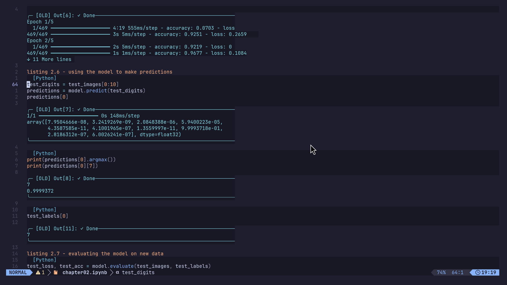

# ipynb.nvim

jupyter notebooks in neovim. edit cells, run code, view plots, and reopen saved
outputs. works with lazyvim, lazy.nvim, or neovim's built-in package loader.



## install

you need neovim 0.12+, python 3.10+, git, curl, tar, a c compiler and
tree-sitter-cli 0.26.1+. inline plots need imagemagick and a kitty-compatible
terminal such as kitty or ghostty. `uv` is optional and speeds up python setup.

### lazyvim or lazy.nvim

1. create `~/.config/nvim/lua/plugins/ipynb.lua` with:

   ```lua
   return {
     { "WhiteHades/ipynb.nvim", version = "0.1.0", lazy = false, opts = {} },
   }
   ```

2. run `:Lazy sync`, then restart neovim. notebook tools install automatically.
3. open a notebook with `nvim example.ipynb`. a new path creates a blank notebook.

for plain lazy.nvim, add the same plugin specification to your existing setup.
if you already set `python3_host_prog`, install this repo's `requirements.txt`
into that environment first; `:help ipynb-options` explains custom runtimes.

<details>
<summary>plain neovim without a plugin manager</summary>

on linux, run:

```sh
git clone https://github.com/WhiteHades/ipynb.nvim \
  ~/.local/share/nvim/site/pack/ipynb/start/ipynb.nvim
python3 ~/.local/share/nvim/site/pack/ipynb/start/ipynb.nvim/scripts/install-native.py
```

add these lines to `~/.config/nvim/init.lua`, then restart:

```lua
require("image").setup({ processor = "magick_cli" })
require("ipynb").setup()
```

without inline plots, use only `require("ipynb").setup({ images = false })`.
if you changed your data directory, replace `~/.local/share/nvim` with the path
shown by `:lua print(vim.fn.stdpath("data"))`.

</details>

## use

put the cursor inside a cell. `:Ipynb` opens the action menu, so you do not need
to memorise the shortcuts. keys below use normal mode and the default
`<localleader>` of `\`.

| key | action |
| --- | --- |
| `\r` or ctrl-enter | run cell; `\r` also runs a visual selection |
| shift-enter | run and move to the next code cell |
| `\R` / `\a` | run all / run this cell and above |
| `\b` / `\m` | insert a code / markdown cell below |
| `\o` | open full output; scroll with normal vim motions |
| `\O`, `q`, escape | close the output window |
| `\s` / `\i` | interrupt / restart the kernel |
| `\n` / `\x` | action menu / rich output |

`:w` saves cells and outputs. reopening restores results without rerunning code;
saved results are marked `[OLD]` until rerun.
python variables and trained models need their own save/load code. restarting
the kernel clears its variables. existing mappings are preserved; modified
enter keys depend on terminal support, and the action menu always works.

numpy scalars use book-style display: `np.uint8(7)` appears as `7`, without
changing the value or dtype. set `numpy_legacy_repr = false` to keep modern
numpy formatting. older saved outputs change when their cells run again.

use `:checkhealth ipynb` for setup problems, `:IpynbInstall` to repair the managed
python environment, and `:help ipynb` for custom environments. the notebook
runtime is local; hosted compute, collaboration and browser widgets are outside
this release.

## credits

includes the customised [molten](https://github.com/benlubas/molten-nvim) runtime,
derived from [magma](https://github.com/dccsillag/magma-nvim). uses jupytext,
jupyter, quarto-nvim, otter.nvim, treesitter and image.nvim.
[full credits and provenance](CREDITS.md). [gpl-3.0 licence](LICENSE).
